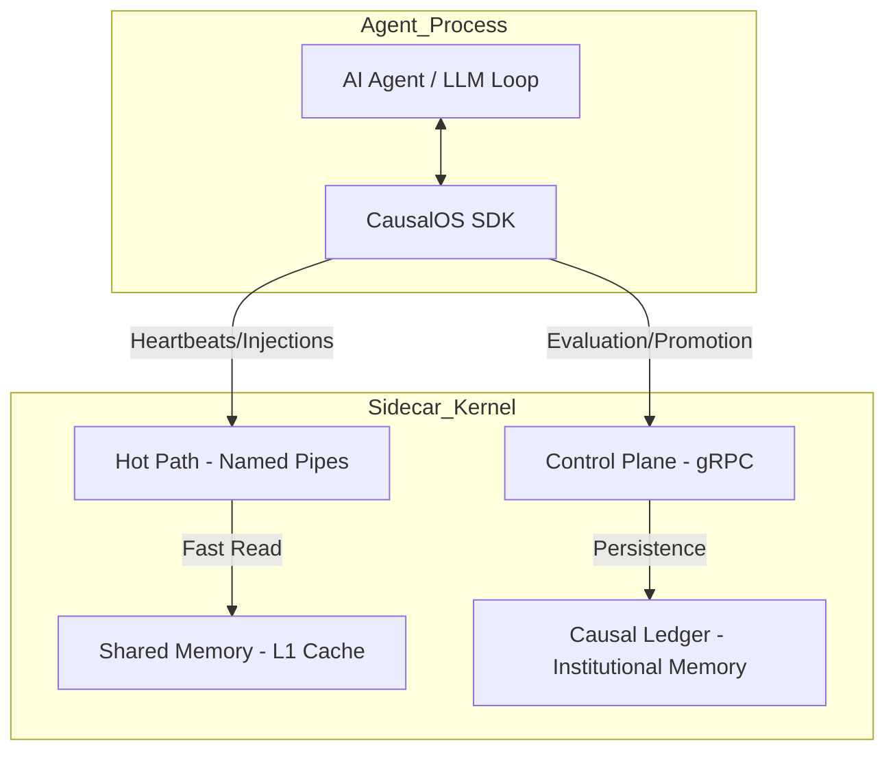

# CausalOS Agent Runtime

**CausalOS** is a specialized, high-performance "Agent Kernel" designed to provide deterministic governance, institutional memory, and split-plane execution for autonomous AI agents.

## 🧠 Why CausalOS?
Modern agents often operate in an "unconstrained" loop where failures are forgotten and risks are high. CausalOS solves this by providing:
- **Safety Plane**: Intercept and evaluate tool calls before execution.
- **Institutional Memory**: A persistent "Causal Ledger" that stores successful patterns and reinforced failures.
- **Micro-latency IPC**: Ultra-fast shared memory (L1 Cache) for real-time context injection.

## 🏗️ Architecture
CausalOS uses a **Split-Plane Architecture** to isolate the safety-critical Kernel from the high-frequency Agent loop.

## 📂 Project Structure
- **[sidecar/](sidecar/)**: The Rust implementation of the CausalOS Kernel.
- **[sdk/](sdk/)**: The developer library for integrating agents into the CausalOS fabric.
- **[proto/](proto/)**: gRPC and Protobuf definitions for the kernel protocol.
- **[docs/](docs/)**: Detailed technical specifications and guides.

## 🚀 Quick Start
Ready to run your first causal loop? 
See the **[QuickStart Guide](docs/QUICKSTART.md)**.

## 📚 Documentation
- [Architecture & Design](docs/ARCHITECTURE.md)
- [API & Protocol Specification](docs/API_SPEC.md)
- [Technology Stack](docs/TECH_STACK.md)
- [Developer Roadmap](docs/ROADMAP.md)

---
*Built with ❤️ by the CausalOS Team.*
